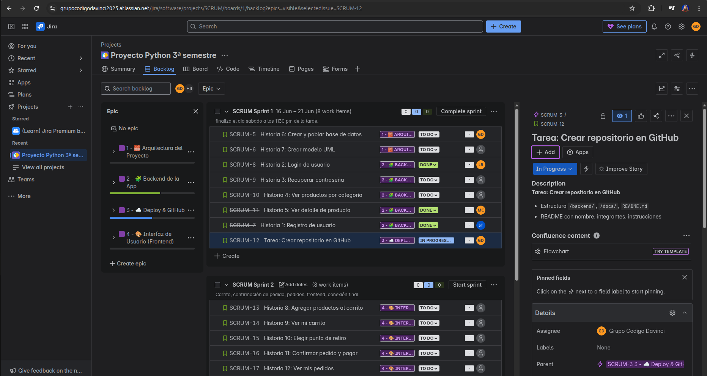
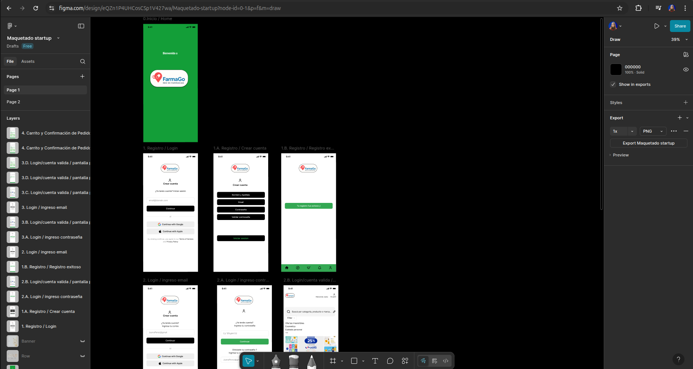

# Proyecto Integrador - Python

## Imagen de la consigna

=======
# 🧪 Proyecto Integrador Python: FarmaGo

Nuestra startup es una red de cadenas de farmacias que integra una plataforma digital compuesta por una página web y una aplicación móvil. A través de estos canales, los clientes pueden solicitar medicamentos y productos farmacéuticos. 
Se garantiza la entrega en un plazo máximo de 48 horas para el retiro en el punto de venta más cercano a la ubicación proporcionada por el usuario al momento de simular el pago, siempre y cuando haya stock disponible en ese punto de retiro. En caso de no haber stock disponible en el punto más cercano, el sistema informará al cliente antes de finalizar la compra para que pueda decidir si desea continuar o elegir otro punto de retiro.
Esta propuesta se enmarca principalmente en el segmento de Biomedicina (3.4) debido a su enfoque en salud y medicamentos, con un fuerte componente de Desarrollo de Software (3.9) por la plataforma digital que soporta la operación. 
Además, se incorporan tecnologías de inteligencia artificial para optimizar la gestión de inventarios y logística, junto con protocolos robustos de ciberseguridad para proteger la información y las transacciones de los usuarios.

---
# Logo

## 🖼️ Mockup de la App

## 📋 Sprint actual en Jira

## 📄 Documentación del Proyecto

Accedé a toda la documentación desde el siguiente enlace:

🔗 [Documentación en Google Drive](https://drive.google.com/drive/folders/1Bgr67p-ABDhnHOeTNAMaOUnpYdrHpVgT?usp=drive_link)

---

## 👥 Equipo

| Machuca, Carmen Irene
| Torres, Santiago
| Felipe, Valentín
| Pardo, David
| Milagros, Cañete
| Reynoso, Lucas

## ⚙️ Tecnologías

- Python (Flask)
- JavaScript
- Postgresql
- HTML/CSS
- Jira (gestión ágil)
